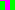

### Name
Write out of bounds

### Description
If a square is incomplete because `width` is not a multiple of `square_width`, the programm writes past his bound into the next line of the picture.
If a square is incomplete because `height` is not a multiple of `square_width`, the programm tries to write past the arry, and a segmentation fault occurs.

### Affected Lines
In `checkerboard.c:110` and `checkerboard.c:111`

### Expected vs Observed
We expect to have incomplete squares if the image size is not a multiple of `square_width`.
We observe that the first square gets overwritten by the second one if `width` is not a multiple of `square_width`.
We observe segmentation fault if `height` is not a multiple of `square_width`.


### Steps to Reproduce
Create a small checkerboard picture where `width`is not a multiple of `square_width`
Create a small checkerboard picture where `height`is not a multiple of `square_width`

#### Command

```
./checkerboard poc.png 10 15 10 ff00ff 00ff00 
./checkerboard poc.png 15 10 10 ffffff 000000 
```

#### Proof of Concept input
For the width bug, magnified 10 times




### Suggested Fix Description
Add a check to catch if we are about to write past the array in `checkerboard.c:110`
Add a check to catch if we are about to write past the array in `checkerboard.c:111`
